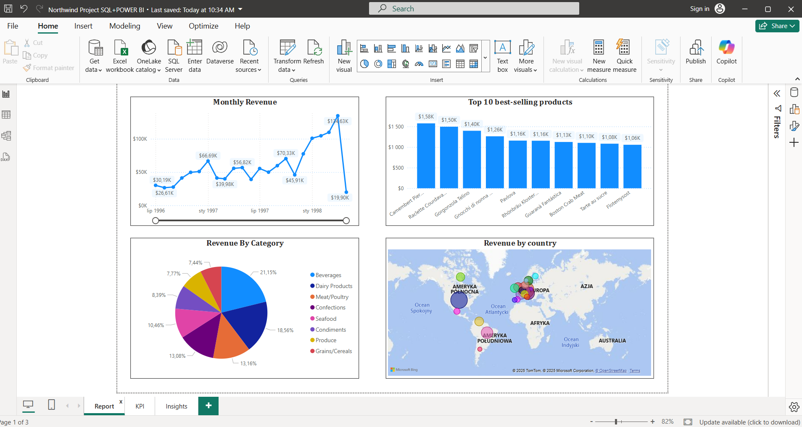
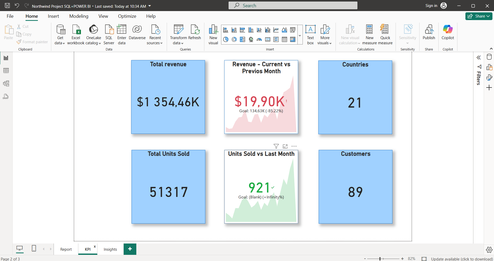
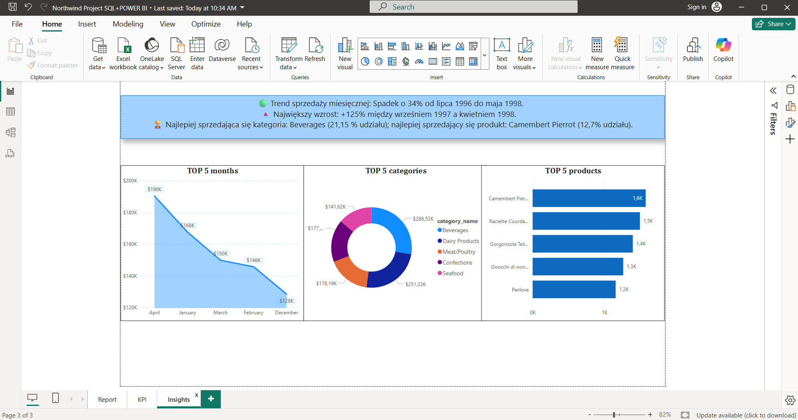

# 📊 Northwind Sales Dashboard (SQL + Power BI)

Projekt analizy sprzedaży z użyciem bazy Northwind, Power BI i zapytań SQL. Celem było stworzenie przejrzystego raportu sprzedażowego zawierającego KPI, analizę miesięczną oraz insighty.

## 🗂️ Źródło danych
- Baza danych: Northwind (PostgreSQL)
- Tabele: orders, order_details, products, categories, customers

## 🧰 Narzędzia
- SQL (PostgreSQL)
- Power BI

## 🔍 Zawartość raportu

### Strona 1: Dashboard sprzedażowy
- Monthly Revenue (liniowy wykres)
- Top 10 Best-selling Products (kolumnowy)
- Revenue by Category (pie-chart)
- Revenue by Country (mapa)

### Strona 2: KPI
- Total Revenue, Total Units Sold, Countries Shipped, Unique Customers
- KPI z porównaniem miesiąc do miesiąca (Revenue & Units Sold)

### Strona 3: Insights
- Smart Narrative
- Top 5 Months (area chart)
- Top 5 Categories (donut chart)
- Top 5 Products (bar chart)

## 🧠 Wnioski
- Największy wzrost sprzedaży zaobserwowano w kwietniu 1998
- Produkt „Camembert Pierrot” miał najwyższą sprzedaż jednostkową
- Najbardziej dochodowa kategoria: Beverages

## 🖼️ Zrzuty ekranu

## 📁 Pliki
- [📥 Pobierz raport Power BI (.pbix)](northwind_project.pbix)
- [northwind_project.sql](northwind_project.sql) – zawiera wszystkie zapytania SQL użyte w projekcie (KPI, wykresy, insighty).
